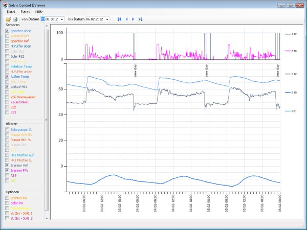
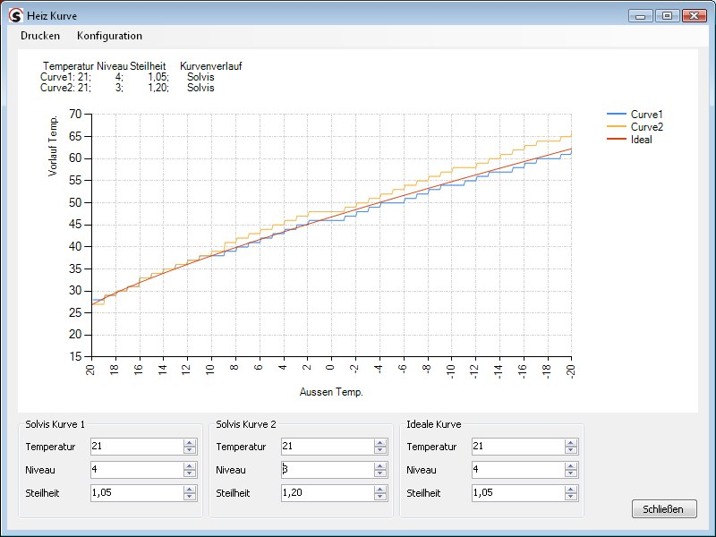

# SolvisSC2Viewer
#

## Beschreibung
#
Dieses Programm kann die Logdateien der Solvis-Steuerung SolvisControl 2 auslesen und grafisch darstellen. Zusätzlich wird der Verlauf von Heizkurven dargestellt. Im Programm ist eine Hilfe für die Benutzung des Programms und dem Einstellen der Heizkurve und anderer Parameter enthalten.

SolvisSC2Viewer ist Open Source Software, veröffentlicht unter der GNU General Public License.

Eine Bildschirmauflösung von mindestens 1024 x 768 muss vorhanden sein.

Das Programm ist mit der kostenlosen Entwicklungsumgebung Microsoft Visual Studio 2010 Express in der Programmiersprache C# geschrieben und lauffähig unter dem .NET 4.0 Framework. Es ist lauffähig unter Windows (ab XP).

## Themen des SolvisSC2Viewer Programms
#### (in der Programm-Hilfe integriert):
- Logdaten Anzeige 
- Heizkurven Anzeige 
- Optimale Heizkurve einstellen 
- Sensoren prüfen 
- Konfiguration 
- Zeitplan Einstellungen 

## Funktionen
- Auslesen der Daten von der Speicherkarte
- Einfache tageweise Navigation
- Beliebige Zeiträume auswertbar
- Auswahl im Chart
- Freie Formeln für Chart-Darstellung
- Konfigurations-Editor
- Speicherung der Konfiguration
- Verlauf der Heizkurve
- Dokumentation Einstellung Heizkurve
- Zeitübersicht Heizkreise, Warmwasser, ... (zeitplan.txt)

## Installation
 Voraussetzung für die Installation des Programms auf einem Windows-System
 ist das .NET Framework 4.0. Falls es noch nicht auf dem Rechner installiert ist,
 kann das .NET Framework 4.0 von der Microsoft-Seite kostenfrei heruntergeladen
 werden.

[Microsoft .NET Framework](http://www.microsoft.com/netframework)

 Das .NET Framework ist zuerst zu installieren.
 Danach erfolgt die Installation des Programms mit der Datei SolvisSC2.msi
 (Doppelklick im Datei-Explorer). Das Programm ist jetzt im Programmverzeichnis
 Solvis\SolvisSC2 installiert. Über das Startmenu Programme\SolvisSC2 kann
 das Programm aufgerufen werden.

## aktuelles Setup
#### (in Zipdatei gepacktes MSI Setup)

[SolvisSC2.msi](https://github.com/harborsiem/SolvisSC2Viewer/files/1371292/SolvisSC2_V2.1.zip)

## Bilder vom SolvisSC2Viewer

